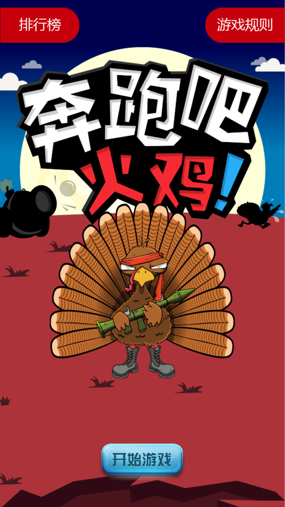

# blaze与meteor开发基于微信的H5小游戏
# 描述
>H5小游戏开发周期短，广告开发商一般会使用它在节日期做一些推广，然后引导用户微信分享以达到宣传和统计效果。这款小游戏叫我要打火鸡。
## 主要技术栈：
- blaze
- jQuery
- nodejs
- meteor
# 如何运行
## 下载项目
    git clone https://github.com/hszheng/runningTurkey.git
## 安装node环境
    curl https://install.meteor.com/ | sh
## 初始化项目
    meteor npm install
## 启动
    meteor --port 3006
> 手机浏览器或PC浏览器模拟器查看效果

